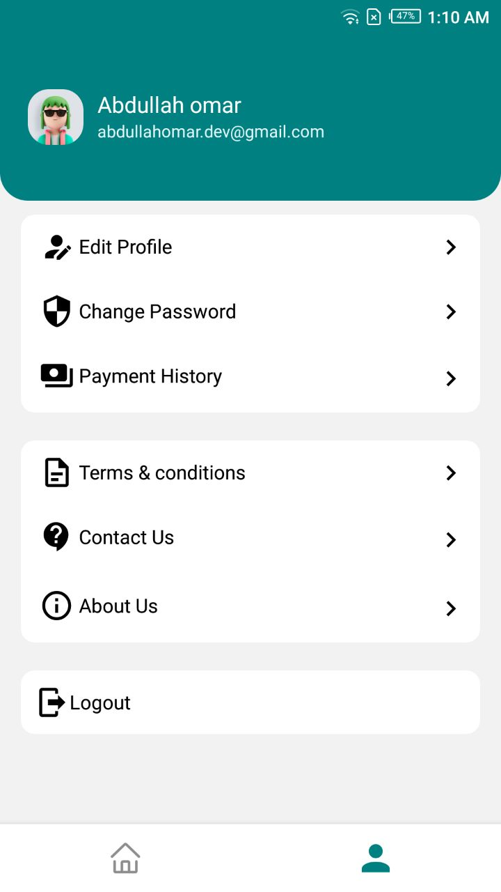
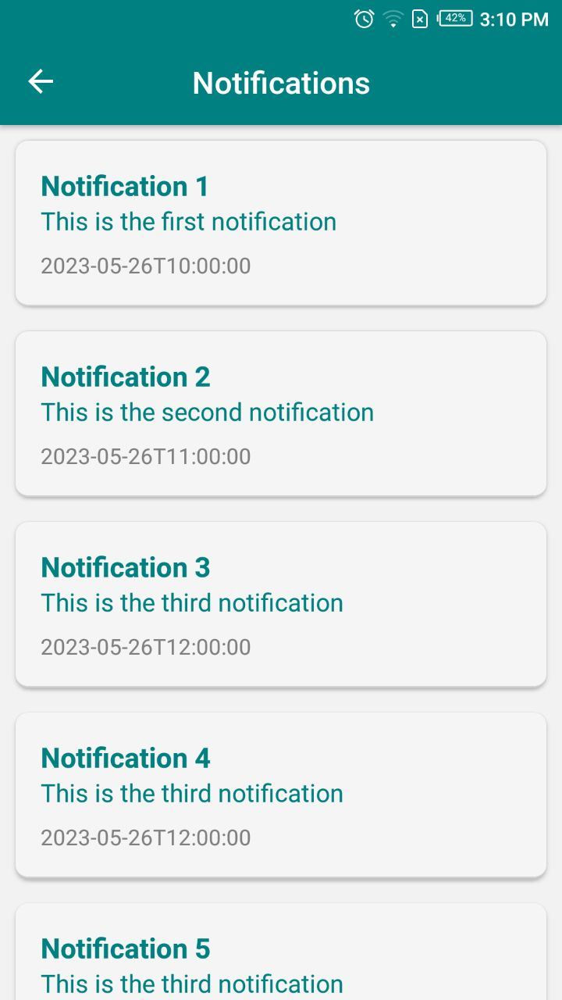

# Tabib (online courses platform)

## Description
Tabib is a mobile application built with React Native and Firebase. It provides medical students with access to a variety of courses and educational resources. The app allows students to browse courses, track their progress, and interact with course materials.

## Features
- Browse and search for available courses
- Enroll in courses and track progress
- Access course materials, including videos, documents
- Mark favorite courses for easy access
- Interact with instructors through chat or discussion forums
- Push notifications for course updates and announcements

## Screenshots

    
     
    
    
    
    
    

## Technologies Used
- React Native
- Firebase (Firestore, Authentication, Storage , cloud functions)
- Expo

## Progress
- :white_check_mark: Coding more than 70% from the design
- :white_check_mark: setup annd connect the Firebase resouces with the app (Firestore, Authentication, Storage ) 

## Setup Instructions
1. Clone the repository: `git clone https://github.com/abdullah-omar-aly/Tabib.git`
2. Install dependencies: `npm install`
3. Set up Firebase project and obtain necessary credentials (Firebase config)
4. Create a `.env` file and add your Firebase config details (the variables needed in the .env.example file)
5. Start the app: `npm start`
6. Use the Expo app on your mobile device to scan the QR code and open the app

## Development
- The app is developed using React Native and Expo.
- Firebase is used for backend services, including Firestore for data storage, Authentication for user management, and Storage for file uploads.
- Additional dependencies and libraries are listed in the `package.json` file.

